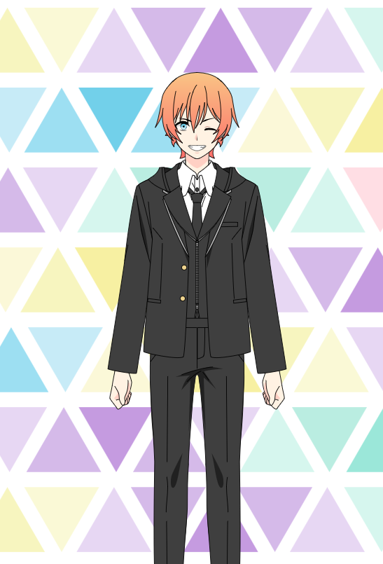

<!-- Template Readme Inspired from https://github.com/durgeshsamariya/awesome-github-profile-readme-templates/blob/master/templates/zillastar.md -->

<h2> About me </h2>
Hi there 👋. I'm Retro&Dev. I'm a student at St Jean and I am interested in programming and game development.
I like to touch everything for discover new things and learn new skills, like Machine Learning, Game and App Development, etc...
I also collect retro games and consoles

  
<h2> Current skills </h2>

- <h4> Progamming languages </h4>
    
    
    
    

    - <h5> What I'm currently learning (seriously) </h5>
       
       
  
- <h4> Software & Libraries </h4>
    
    
    
    

- <h4> Tools </h4>
    
    
    

<h2>Projects </h2>

- [StudySuite](https://github.com/StudySuite) (In Development)
- Minecraft Launcher for [Etercube Server](https://etercube.fr/) (JAVA Only)
- [Wii U Cafe SDK Deluxe](https://github.com/RetroAndDev/WiiUCafeSDKDeluxe) (Maintaining)

