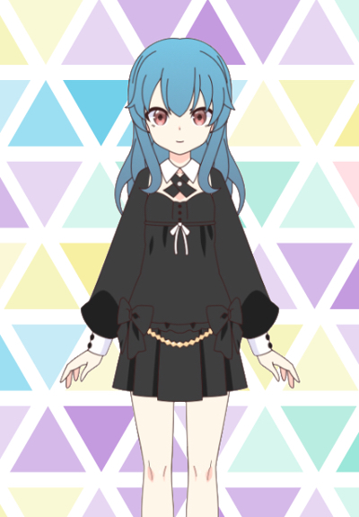

<!-- Template Readme Inspired from https://github.com/durgeshsamariya/awesome-github-profile-readme-templates/blob/master/templates/zillastar.md -->

<h2> About me </h2>
Hi there 👋. I'm Retro&Dev. I'm a student at St Jean and I am interested in programming and game development.
I like to touch everything for discover new things and learn new skills, like Machine Learning, Game and App Development, etc...
I also collect retro games and consoles

  
<h2> Current skills </h2>

- <h4> Progamming languages </h4>
    
    
    

    - <h5> Languages I have already used in the past </h5>
        
        
        
        
  
- <h4> Software & Libraries </h4>
    
    
    

- <h4> Tools </h4>
    
    
    
    

<h2>Projects </h2>
  
- [CrystalOS (Main Project)](https://github.com/RetroAndDev/CrystalOS)
  
- Videos Games with Unity
  
- [Wii U Cafe SDK Deluxe](https://github.com/RetroAndDev/WiiUCafeSDKDeluxe)

